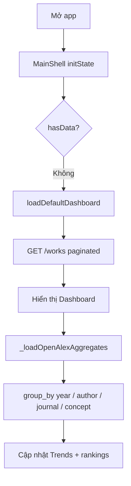
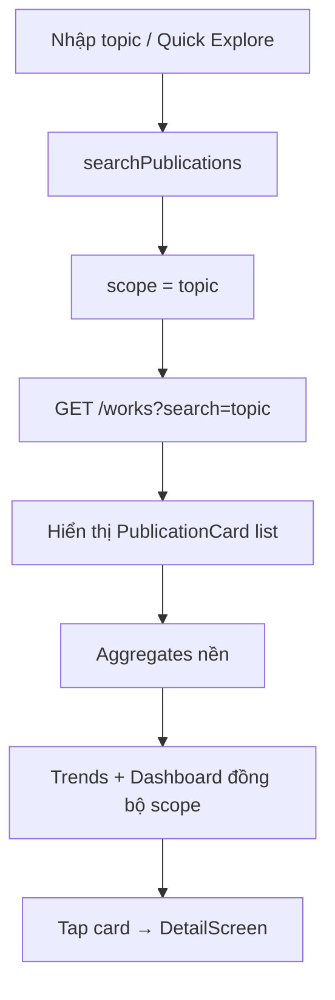
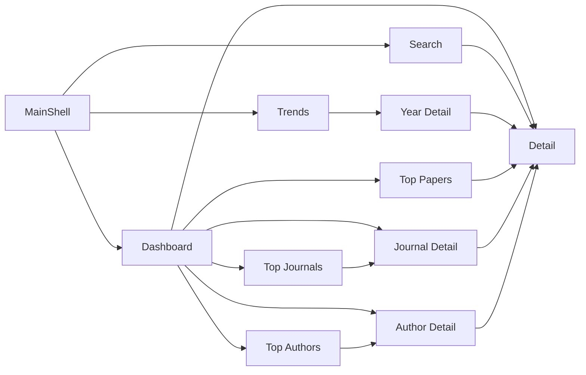

# Journal Trend Analyzer — Kiến trúc & chức năng chi tiết

> **App:** PRM393 Lab 2 — `PRM393_Lab2_SE182125`  
> **Stack:** Flutter · Provider · OpenAlex API (không backend / DB / login)  
> **Theme:** Dark · logo raccoon · bottom navigation 3 tab

---

## 1. Tổng quan

Ứng dụng phân tích xu hướng nghiên cứu khoa học bằng cách gọi trực tiếp [OpenAlex API](https://developers.openalex.org/). Dữ liệu được tổng hợp theo hai phạm vi:

| Phạm vi | Kích hoạt | Mô tả |
|---------|-----------|--------|
| **Global** | Mở app lần đầu | Top bài ảnh hưởng toàn cầu (publication_year > 2015) |
| **Topic** | Search / Quick Explore | Phân tích theo chủ đề người dùng nhập |

**Approach 2 (Dashboard-first):** App tự load Dashboard khi khởi động; Search dùng để đào sâu theo chủ đề; Trends hiển thị biểu đồ và drill-down theo năm.

---

## 2. Kiến trúc tầng

```
┌─────────────────────────────────────────────────────────────┐
│  UI Layer (screens + widgets)                               │
│  Dashboard · Search · Trends · Detail · Top * · Year detail │
└───────────────────────────┬─────────────────────────────────┘
                            │ context.watch / read
┌───────────────────────────▼─────────────────────────────────┐
│  State Layer (Provider)                                     │
│  PublicationProvider · AppNavigationProvider                │
└───────────────────────────┬─────────────────────────────────┘
                            │
        ┌───────────────────┼───────────────────┐
        ▼                   ▼                   ▼
┌───────────────┐  ┌────────────────┐  ┌──────────────────┐
│ OpenAlexService│  │ count_format   │
│ HTTP + retry   │  │ format số lớn  │
└───────┬───────┘  └────────────────┘  └──────────────────┘
        │
        ▼
┌─────────────────────────────────────────────────────────────┐
│  OpenAlex REST API — api.openalex.org                       │
│  /works (paginated, group_by, filter, search)               │
└─────────────────────────────────────────────────────────────┘
```

### Nguyên tắc thiết kế

1. **100% dữ liệu từ OpenAlex API** — không tính analytics local trên cache; mỗi metric có endpoint riêng.
2. **Load hai pha:** meta/count + works list (search) trước → aggregates sau (`isTrendLoading`).
3. **Drill-down theo ID:** author/journal detail gọi `filter=authorships.author.id` / `primary_location.source.id`.

---

## 3. Cấu trúc thư mục

```
PRM393_Lab2_SE182125/
├── lib/
│   ├── main.dart                    # MultiProvider, MaterialApp, theme
│   ├── models/
│   │   ├── publication.dart         # Model chính + fromJson OpenAlex
│   │   ├── author.dart              # Model phụ (legacy / mở rộng)
│   │   ├── journal.dart             # Model phụ (legacy / mở rộng)
│   │   └── openalex_works_result.dart
│   ├── services/
│   │   ├── openalex_service.dart    # Gọi API, retry, parse group_by
│   │   └── openalex_exception.dart  # Lỗi thân thiện (429, timeout…)
│   ├── providers/
│   │   ├── publication_provider.dart # State nghiệp vụ chính
│   │   └── app_navigation_provider.dart # Tab index bottom nav
│   ├── screens/
│   │   ├── main_shell.dart          # Shell + IndexedStack + auto-load
│   │   ├── dashboard_screen.dart    # §4.7 Dashboard
│   │   ├── search_screen.dart       # §4.1 Topic Search
│   │   ├── trend_screen.dart        # §4.3 Trend Analysis
│   │   ├── detail_screen.dart       # §4.2 Publication Details
│   │   ├── top_papers_screen.dart   # §4.4 Top Papers
│   │   ├── top_journals_screen.dart # §4.5 Top Journals
│   │   ├── top_authors_screen.dart  # §4.6 Top Authors
│   │   ├── author_detail_screen.dart
│   │   ├── journal_detail_screen.dart
│   │   └── year_detail_screen.dart  # Drill-down theo năm
│   ├── widgets/
│   │   ├── app_logo.dart
│   │   ├── dashboard_card.dart
│   │   ├── publication_card.dart
│   │   ├── trend_chart.dart
│   │   ├── journal_bar_chart.dart
│   │   ├── screen_header.dart
│   │   ├── error_banner.dart
│   │   └── empty_state_view.dart
│   ├── utils/
│   │   ├── publication_analytics.dart # Analytics trên sample
│   │   └── count_format.dart          # 1.2M, 980K…
│   └── theme/
│       └── app_theme.dart             # Dark theme, AppColors
├── test/                              # Unit + widget smoke
├── docs/
│   └── kien-truc-app.md               # File này
└── scripts/run.ps1                    # Chạy app + api_key
```

---

## 4. Điều hướng & luồng người dùng

### Bottom navigation (`MainShell`)

| Tab | Index | Màn hình | Vai trò |
|-----|-------|----------|---------|
| Dashboard | 0 | `DashboardScreen` | Tổng quan, 6 metric cards, preview |
| Search | 1 | `SearchScreen` | Tìm chủ đề, Quick Explore |
| Trends | 2 | `TrendScreen` | Biểu đồ 3 metric, tap năm → chi tiết |

`AppNavigationProvider.goToTab(n)` — Dashboard có thể chuyển sang Trends programmatically.

### Luồng khởi động



### Luồng Search



---

## 5. State management — `PublicationProvider`

### Trạng thái chính

| Field | Kiểu | Mô tả |
|-------|------|--------|
| `scope` | `AnalysisScope` | `global` hoặc `topic` |
| `currentTopic` | `String` | Nhãn chủ đề hiện tại |
| `publications` | `List<Publication>` | Sample ~600 bài (6×100 trang) |
| `totalOnOpenAlex` | `int` | `meta.count` từ API |
| `yearlyTrendFromOpenAlex` | `Map<int,int>` | Số bài/năm từ `group_by` |
| `topAuthorsOpenAlex` | `List<MapEntry>` | Top authors từ API |
| `topJournalsOpenAlex` | `List<MapEntry>` | Top journals từ API |
| `topResearchAreasOpenAlex` | `List<MapEntry>` | Top concepts từ API |
| `isDashboardLoading` | `bool` | Load lần đầu / refresh global |
| `isSearchLoading` | `bool` | Đang search topic |
| `isTrendLoading` | `bool` | Đang load aggregates |
| `errorMessage` | `String?` | Lỗi OpenAlex (tiếng Việt) |

### Getter quan trọng

| Getter | Logic |
|--------|-------|
| `rankedAuthors` / `rankedJournals` / `trendingAreas` | Chỉ từ OpenAlex `group_by` |
| `topPapersOpenAlex` | `GET /works` sort citations |
| `averageCitationOpenAlex` | Mean từ top 100 works API |
| `citationsByYearOpenAlex` / `avgCitationsByYearOpenAlex` | `/works` theo từng năm |
| `mostActiveYearLabel` | Peak từ `yearlyTrendFromOpenAlex` |
| `formattedTotalOnOpenAlex` | Format số lớn (1.2M…) |

### Methods

| Method | Khi gọi |
|--------|---------|
| `loadDefaultDashboard()` | App start, refresh global, "Back to global overview" |
| `searchPublications(topic)` | Search submit, Quick Explore, tap research area |
| `refreshCurrentAnalysis()` | Nút refresh Dashboard |
| `loadPublicationsForYear(year)` | YearDetailScreen — 1 trang works theo năm |
| `_loadOpenAlexAggregates()` | Sau works — 4 API group_by (lỗi từng cái → fallback rỗng) |

**Race-safe search:** `_searchGeneration` bỏ qua kết quả search cũ nếu user search liên tiếp.

---

## 6. OpenAlex Service — API mapping

Base URL: `https://api.openalex.org`

Cấu hình: `OPENALEX_API_KEY` qua `--dart-define-from-file=dart_defines.local.json`

| # | Mục đích | Endpoint | Tham số chính |
|---|----------|----------|---------------|
| 1 | Global snapshot | `GET /works` | `sort=cited_by_count:desc`, `filter=publication_year:>2015`, paginate 6×100 |
| 2 | Search topic | `GET /works` | `search={topic}`, `sort=cited_by_count:desc`, paginate |
| 3 | Trend theo năm | `GET /works` | `group_by=publication_year`, `filter=publication_year:2016-{năm hiện tại}` |
| 4 | Top authors | `GET /works` | `group_by=authorships.author.id` |
| 5 | Top journals | `GET /works` | `group_by=primary_location.source.id` |
| 6 | Research areas | `GET /works` | `group_by=concepts.id`, limit 6 |
| 7 | Papers một năm | `GET /works` | `filter=publication_year:YYYY`, `sort=cited_by_count:desc`, 1 trang |

**Global influential filter** (chỉ scope global, không search): thêm `cited_by_count:>100` vào filter aggregates và year drill-down.

**Select fields:** `id, title, publication_year, cited_by_count, authorships, primary_location, abstract_inverted_index, doi, concepts`

**HTTP resilience:**
- Timeout 45s, retry tối đa 4 lần (429, 502, 503, 504)
- Backoff 1.5s × attempt
- `OpenAlexException` — message tiếng Việt cho UI

---

## 7. Model — `Publication`

Parse từ JSON OpenAlex `/works`:

| Field app | Nguồn OpenAlex | Ghi chú |
|-----------|----------------|---------|
| `id` | `id` | OpenAlex URL id |
| `title` | `title` | |
| `year` | `publication_year` | |
| `citations` | `cited_by_count` | |
| `journal` | `primary_location.source.display_name` | Fallback "Unknown Journal" |
| `doi` | `doi` | |
| `authors` | `authorships[].author.display_name` | |
| `abstractText` | `abstract_inverted_index` | Ghép inverted index → câu |
| `concepts` | `concepts[]` | Top 3 concept score ≥ 0.35 |

---

## 8. Analytics local — `PublicationAnalytics`

Tính trên `publications` (sample), dùng khi không có OpenAlex aggregate hoặc cho metric chỉ có trong sample:

| Hàm | Output | Dùng ở |
|-----|--------|--------|
| `averageCitation` | double | Dashboard card Avg Citations |
| `mostActiveYear` | String | Fallback peak year |
| `groupByYear` | Map | Fallback trend volume |
| `citationsByYear` | Map | Trend metric Citation Impact |
| `averageCitationsByYear` | Map | Trend metric Avg Citations |
| `topPapers` | List | Top Papers screen, Dashboard preview |
| `mostInfluentialPaper` | Publication | Dashboard Top Paper card |
| `topJournals` | List | Fallback rankings |
| `topAuthors` | List | Fallback rankings |
| `topResearchAreas` | List | Fallback areas |
| `papersForYear` / `topResearchAreasForYear` | — | Year detail hot topics (sample) |

---

## 9. Chi tiết từng chức năng (§4.1 – §4.7)

### §4.1 Topic Search — `SearchScreen`

**File:** `screens/search_screen.dart`, `widgets/publication_card.dart`

| Thành phần | Mô tả |
|------------|--------|
| Search bar | TextField + submit → `searchPublications` |
| Quick Explore | 6 shortcut (AI, Data Science, Cybersecurity, IoT, Blockchain, SE) |
| Trending areas | Khi global: hiển thị `provider.trendingAreas` (OpenAlex concepts) |
| Kết quả | `PublicationCard`: Title, Year, Citations, Journal |
| Back to global | Nút reset về `loadDefaultDashboard` |
| Loading | `isSearchLoading` + spinner local; aggregates chạy nền |

**Navigation:** Tap card → `DetailScreen`

---

### §4.2 Publication Details — `DetailScreen`

**File:** `screens/detail_screen.dart`

Hiển thị đầy đủ một bài báo:

- Title, Authors (chips), Year, Journal  
- Citations, DOI (link nếu có)  
- Abstract (scroll)  
- Concepts / research areas  

---

### §4.3 Publication Trend Analysis — `TrendScreen`

**File:** `screens/trend_screen.dart`, `widgets/trend_chart.dart`

3 metric (segmented control):

| Metric | Nguồn dữ liệu | Ghi chú UI |
|--------|---------------|------------|
| Publication Volume | **OpenAlex** `yearlyTrendFromOpenAlex` | Số thật, format lớn |
| Citation Impact | **Sample** `citationsByYear` | Tổng citations/năm trong sample |
| Avg. Citations | **Sample** `averageCitationsByYear` | TB citations/năm trong sample |

- Biểu đồ cột (`TrendChart`), trục Y cố định  
- Danh sách năm (mới → cũ), hiển thị count  
- **Tap năm** → `YearDetailScreen`

---

### §4.4 Top Papers — `TopPapersScreen`

**File:** `screens/top_papers_screen.dart`

- Sắp xếp sample theo `cited_by_count` giảm dần  
- Dedupe theo `publication.id`  
- Tap → `DetailScreen`  
- Vào từ Dashboard: card "Avg Citations", section "Most Influential Papers"

---

### §4.5 Top Research Journals — `TopJournalsScreen`

**File:** `screens/top_journals_screen.dart`, `widgets/journal_bar_chart.dart`

- **Ưu tiên:** `provider.rankedJournals` (OpenAlex `group_by=primary_location.source.id`)  
- **Fallback:** đếm journal trong sample  
- UI ghi **(OpenAlex)** khi có API data  
- Tap journal → `JournalDetailScreen` (papers khớp tên trong sample)

Dashboard: bar chart preview top 5 journals.

---

### §4.6 Top Contributing Authors — `TopAuthorsScreen`

**File:** `screens/top_authors_screen.dart`

- **Ưu tiên:** `provider.rankedAuthors` (OpenAlex `group_by=authorships.author.id`)  
- **Fallback:** đếm author trong sample  
- Tap author → `AuthorDetailScreen` (papers có author trong sample)

---

### §4.7 Research Trend Dashboard — `DashboardScreen`

**File:** `screens/dashboard_screen.dart`, `widgets/dashboard_card.dart`

**6 metric cards (tap được):**

| Card | Giá trị | Nguồn | Tap → |
|------|---------|-------|-------|
| Total Publications | `formattedTotalOnOpenAlex` | OpenAlex meta.count | Tab Trends |
| Avg. Citations | TB citations | Sample | Top Papers |
| Peak Year | Năm + count OpenAlex | OpenAlex group_by | Tab Trends |
| Top Journal | Tên journal #1 | OpenAlex / sample | Journal detail |
| Top Author | Tên author #1 | OpenAlex / sample | Author detail |
| Top Paper | Số cites cao nhất | Sample | Detail |

**Sections bổ sung:**

- `TopicBanner` — scope, sample count, total OpenAlex  
- Top Research Areas — chips full-width, tap → search topic  
- Most Influential Papers — preview 3 bài  
- Top Journals — `JournalBarChart`  
- Top Authors — preview 3 người  
- Refresh icon → `refreshCurrentAnalysis`

---

## 10. Màn hình phụ (secondary)

### `YearDetailScreen`

- Gọi `loadPublicationsForYear(year)` — API 1 trang, sort citations  
- Header: số bài OpenAlex vs số hiển thị  
- Hot topics: `topResearchAreasForYear` từ sample  
- List `PublicationCard`

### `AuthorDetailScreen` / `JournalDetailScreen`

- Nhận tên + `List<Publication>` đã lọc từ sample  
- List papers + tap → Detail  
- *Lưu ý:* Số trên ranking là OpenAlex; danh sách chi tiết có thể ít hơn (chỉ papers trong sample khớp tên)

---

## 11. Widgets tái sử dụng

| Widget | Vai trò |
|--------|---------|
| `AppLogo` | Logo raccoon + fallback asset |
| `ScreenHeader` | Tiêu đề + trailing actions |
| `DashboardCard` | Card metric 2 cột grid |
| `PublicationCard` | Row bài báo trong list |
| `TrendChart` | Bar chart trend theo năm |
| `JournalBarChart` | Horizontal bar top journals |
| `ErrorBanner` | Lỗi + nút Retry |
| `EmptyStateView` | Trạng thái rỗng |

---

## 12. Theme

**File:** `theme/app_theme.dart`

- Dark background, surface cards, border subtle  
- `AppColors`: textPrimary, textSecondary, surface, border, accent  
- Material 3 `NavigationBar` cho bottom nav

---

## 13. Testing

| File | Nội dung |
|------|----------|
| `publication_test.dart` | Parse JSON → Publication |
| `publication_analytics_test.dart` | groupByYear, top entities |
| `openalex_group_by_test.dart` | parseGroupByYear, parseGroupByNamedCounts |
| `openalex_service_test.dart` | OpenAlexException; live API (skip nếu không có key) |
| `widget_test.dart` | Smoke test MainShell |

```powershell
cd PRM393_Lab2_SE182125
flutter analyze
flutter test
```

---

## 14. Chạy app

1. Tạo `dart_defines.local.json` với `OPENALEX_API_KEY`  
2. Chạy từ repo root:

```powershell
.\scripts\run.ps1
```

---

## 15. Ánh xạ đề bài Lab 2

| Yêu cầu đề | Implementation | Trạng thái |
|-------------|----------------|------------|
| §4.1 Search | `SearchScreen` + OpenAlex `/works?search=` | ✅ |
| §4.2 Detail | `DetailScreen` | ✅ |
| §4.3 Trend | `TrendScreen` + OpenAlex group_by + chart | ✅ |
| §4.4 Top Papers | `TopPapersScreen` | ✅ |
| §4.5 Top Journals | `TopJournalsScreen` + OpenAlex group_by | ✅ |
| §4.6 Top Authors | `TopAuthorsScreen` + OpenAlex group_by | ✅ |
| §4.7 Dashboard | `DashboardScreen` 6 metrics | ✅ |
| Provider state | `PublicationProvider` | ✅ |
| OpenAlex trực tiếp | `OpenAlexService` | ✅ |
| Không backend/DB/login | — | ✅ |

---

## 16. Sơ đồ phụ thuộc màn hình



---

*Tài liệu đồng bộ với codebase tại thời điểm implement OpenAlex `group_by` cho authors, journals, concepts và paginate 6×100 works.*
